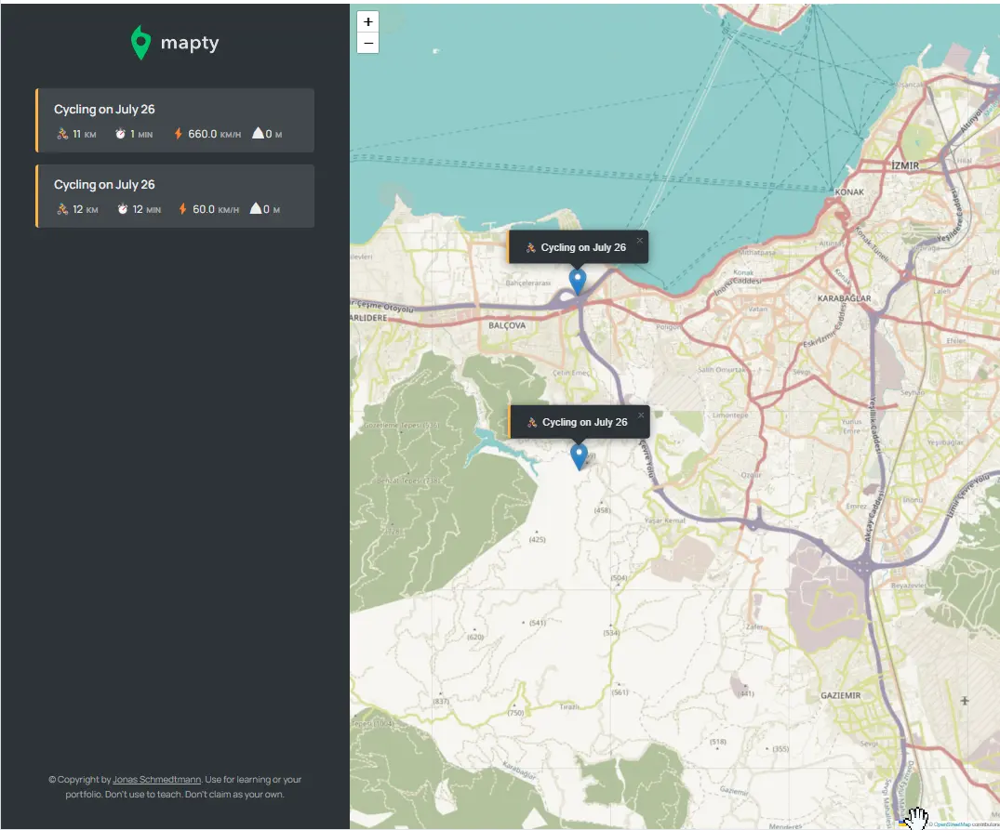

### 👋 **I am Erhan ERTEM**

&emsp;

## Udemy The Complete JavaScript Course 2022 From Zero to Expert! by Jonas Schmedtmann

### **Objective:** Create map based exercise logger app

- Explore GeoLocation WEB API
- Use leaflet.js library for app map
- Create class, class functions, private variables, call-back function binding inside classes
- Explore localStorage WEB API

&emsp;

#### [Mapty-App](https://mapty-app-erhan-ertem.netlify.app)

---

  
